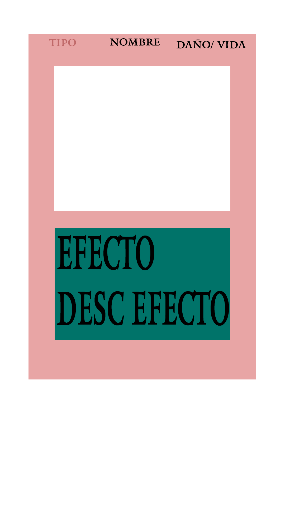

# Blossom

Este proyecto es un juego de cartas con interaccion con twitch donde, la gente a traves del chat, uso de puntos del canal, subs o bit pueda terner sus propias cartas.

## Idea general

Extension de twitch donde cada X tiempo se seleccione une ganadore la cual pueda crear su propia carta, a traves de puntos del canal podran personalizarlas.

Le streamer podra seleccionar si usar imagenes de servicios externos u propios a traves de una carpeta

Permitir a les mods moderar cartas.

Antes de que una carta sea publicada y añadida al deck de cartas, deben ser aprovades por un mod del canal

### Brainstorming (Nice to Have)
- Habilidades personalizables
- Animacion de upgrade de carta Common -> Rare -> Super Rare -> Epic -> Legendary (cada nivel puede ser customizado por le streamer)
- Visualizacion de deck (1a fase solo en stream, 2a fase en cualquier momento con un bot o algo)
- Arena pelea contra el boss (que sea le streamer), va atacando una carta cada vez y se guarda en un deck y cuando haya terminado la cola se hace un shuffle
- Recomenpensas definidas por le streamer (Rollo una cajita de texto)

### Diseño

